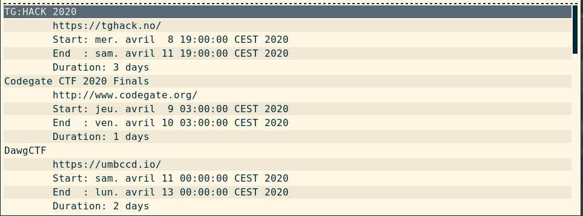

# Script: polybar_ctftime

A small shell script that indicates the position of your team in the ranking.  
A left click displays the next 10 ctfs using rofi for display. If you enter on the url, `xdg-open` is invoked

  
  

## Dependencies
* `jq`
* `FiraCode Nerd Font`

## Configuration
In the `polybar` configuration file, you have to enter your team id.  
In the shell script, you can change various parameters in function `get_upcoming` such as:  
* start date
* end date
* number of results

You can also modify the call to rofi to adapt it to your theme.  
## Module

```ini
[module/ctftime]
type=custom/script
format=<label>
label = "%output%"
exec = /home/neko/.config/polybar/scripts/ctftime.sh --rank 9135
format-prefix="⚑ "
format-prefix-foreground= #c32c35
click-left = /home/neko/.config/polybar/scripts/ctftime.sh --upcoming
```
